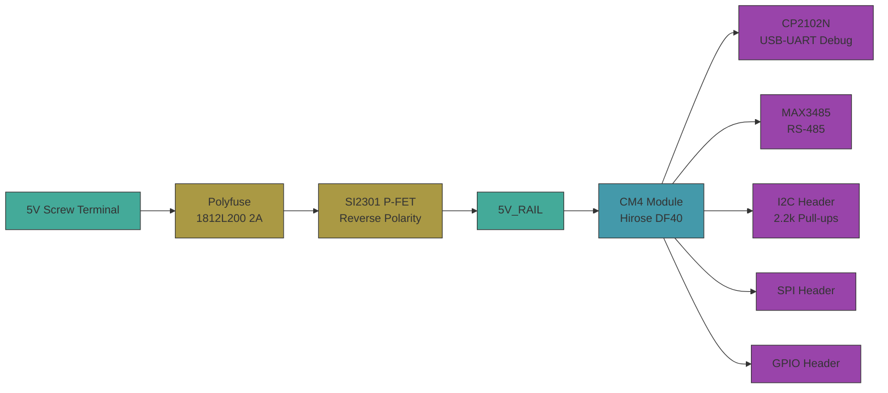

# [electrical-pcb] ⚡


CM4 carrier board — general-purpose Raspberry Pi Compute Module 4 carrier with 5V screw terminal input, polyfuse + reverse polarity protection, CP2102N USB-UART debug, MAX3485 RS-485, I2C/SPI/GPIO headers on 2.54mm pitch, 100x80mm 2-layer board.

A foundation board that exposes raw CM4 interfaces via headers. Not coupled to any specific application — downstream projects connect sensors, actuators, or other peripherals.

## Board Spec



## Workflow

```
theory.ipynb (sympy + pint) -> cad/model.py (SKiDL -> netlist) -> sim/ (power + signal integrity) -> pytest (assert vs theory)
```

1. `theory.ipynb` derives power rail budget, polyfuse margin, I2C pull-up selection, RS-485 bias
2. `cad/model.py` defines circuit in SKiDL, generates KiCad netlist
3. `sim/model.py` validates power rail voltage, I2C rise time, RS-485 bias
4. `sim/test_run.py` asserts simulation matches theory within tolerance
5. `/generate-schematic` generates professional `.kicad_sch` from netlist + `layout_spec.yaml`

## Quick Start

```bash
uv sync
uv run poe checks          # ruff format + lint
uv run poe notebook         # execute theory.ipynb
uv run poe build            # SKiDL -> KiCad netlist + schematic
uv run poe sim              # 4/4 tests pass
```

## Code to Fabrication

```
/generate-schematic → validate-model → inspect-model → generate-model → inspect-asm → validate-asm → generate-asm
```

1. `/generate-schematic` — generate `.kicad_sch` from `model.py` + `layout_spec.yaml`
2. `uv run poe validate-model` — ERC must pass with 0 errors
3. `uv run poe inspect-model` — open in eeschema, tweak if needed, save
4. `uv run poe generate-model` — export schematic SVG + PDF to `output/drawings/`
5. `uv run poe inspect-asm` — open in pcbnew, place components, route traces, save `.kicad_pcb`
6. `uv run poe validate-asm` — DRC must pass with 0 errors
7. `uv run poe generate-asm` — export gerbers + drill + STEP to `output/`

## Structure

- `theory.ipynb` — power budget + signal integrity derivation
- `sim/constants.py` — CM4 power, polyfuse, MOSFET, RS-485, I2C parameters
- `sim/model.py` — power rail, I2C rise time, RS-485 bias simulation
- `sim/test_run.py` — pytest: 4 assertions against theory
- `cad/model.py` — SKiDL circuit definition (imports power.py, comms.py, io_headers.py)
- `cad/power.py` — power input section (polyfuse, MOSFET, bulk caps)
- `cad/comms.py` — RS-485 (MAX3485) + USB-UART (CP2102N)
- `cad/io_headers.py` — I2C, SPI, GPIO headers with pull-ups
- `output/` — exported schematic SVG/PDF, gerbers, STEP
