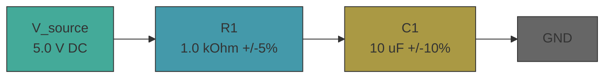

# electrical-base

RC charging circuit — determines the time constant and steady-state voltage of a series RC circuit driven by a DC source.

The analytical solution V(t) = V_s(1 - e^(-t/RC)) provides exact expected values with propagated uncertainty from component tolerances. The PySpice/ngspice simulation solves the same circuit numerically. Agreement between them validates the model and toolchain — the same pattern used in every engineering template.

## Schematic



## Workflow

```
theory.ipynb (sympy derivation + expected values) -> sim/ (PySpice/ngspice transient) -> pytest (assert sim matches theory)
```

1. `theory.ipynb` derives V(t) = V_s(1 - e^(-t/RC)) symbolically, plugs in actual component values with pint + uncertainties to produce expected tau, initial, and final voltages
2. `sim/model.py` builds the netlist and runs a transient simulation using PySpice/ngspice
3. `sim/test_run.py` asserts the simulated time constant and voltages match the analytical values within propagated tolerance

## Quick Start

```bash
uv sync
uv run poe checks
uv run poe notebook
uv run poe sim
```

## Structure

- `theory.ipynb` — sympy derivation, pint + uncertainties, matplotlib verification plot
- `sim/constants.py` — physical parameters with units, tolerances, and sources
- `sim/model.py` — PySpice circuit netlist and transient simulation
- `sim/test_run.py` — pytest assertions: tau, final voltage, initial voltage
- `cad/` — domain templates add schematics here
- `spec/` — domain templates add output artifacts here
