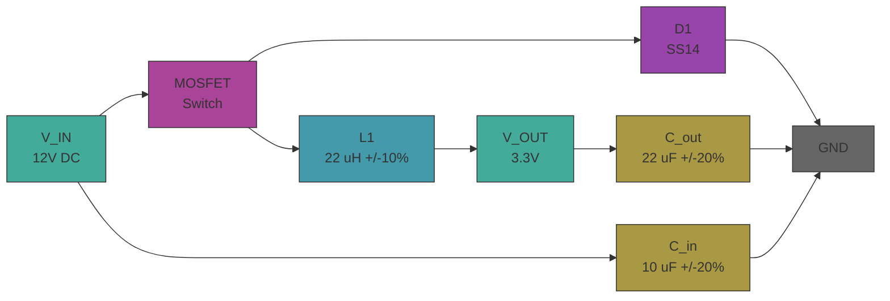

# electrical-base


Buck converter (12V→3.3V, 500kHz) — showcases the full EE toolchain: theory derivation, SPICE simulation, SKiDL schematic generation, and KiCad PCB export.

The analytical CCM solution (D = Vout/Vin, L = Vout(1-D)/(fsw×ΔI)) provides exact expected values. The PySpice/ngspice switching simulation solves the same circuit numerically. Agreement validates the model and toolchain.

## Schematic



## Workflow

```
theory.ipynb (sympy + pint) -> cad/model.py (SKiDL -> netlist) -> sim/ (PySpice transient) -> pytest (assert sim matches theory)
```

1. `theory.ipynb` derives D, L, C symbolically, plugs in component values with pint + uncertainties
2. `cad/model.py` defines the circuit in SKiDL, generates KiCad netlist
3. `sim/model.py` builds PySpice netlist and runs switching transient simulation
4. `sim/test_run.py` asserts steady-state output voltage matches D×Vin within tolerance

### PCB layout flow

PCB layout is a one-time manual step after the netlist is generated:

1. `uv run poe build` — generates `cad/buck_converter.net`
2. `uv run poe inspect-model` — opens KiCad project
3. In KiCad: open pcbnew, import netlist, place components, route traces
4. Save — commit the `.kicad_pcb` file
5. `uv run poe drawings` — kicad-cli exports gerbers, STEP, SVG from the committed PCB

## Quick Start

```bash
uv sync
uv run poe checks          # ruff format + lint
uv run poe notebook         # execute theory.ipynb
uv run poe build            # SKiDL -> KiCad netlist
uv run poe sim              # pytest
uv run poe validate-model   # KiCad ERC
uv run poe inspect-model    # open KiCad project (for PCB layout)
uv run poe inspect-asm      # open PCB in pcbnew
uv run poe drawings         # SVG + PDF to spec/drawings/
```

## Structure

- `theory.ipynb` — sympy derivation, pint + uncertainties, expected values
- `sim/constants.py` — buck converter parameters with units, tolerances, and sources
- `sim/model.py` — PySpice switching transient simulation
- `sim/test_run.py` — pytest assertion: output voltage vs D×Vin
- `cad/model.py` — SKiDL circuit definition → KiCad netlist
- `cad/buck_converter.kicad_pro` — KiCad project (schematic + PCB)
- `spec/drawings/` — exported schematic SVG/PDF, gerbers, STEP
